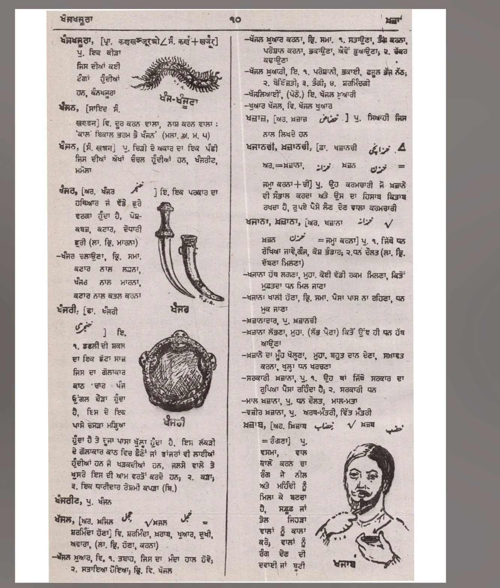

# Punjabi OCR Studio

A web app that reads Punjabi (Gurmukhi) text out of images using Google Cloud
Vision **or Azure AI Vision**, with animated bounding boxes, a "words fly
across" reveal, text download, and an optional AI cleanup step via OpenAI or
Azure OpenAI.

The frontend is a **React (Vite + framer-motion)** single-page app; the backend
is FastAPI. In production the backend serves the built React bundle, so a single
`uvicorn` process runs the whole thing.

## Deploy

One-click deploy to Render (free tier, all-in-one):

[](https://render.com/deploy?repo=https://github.com/HarsimarSingh23/punjabi-ocr)

After it spins up, set `NVIDIA_API_KEY` and `ADMIN_TOKEN` in the Render
dashboard. Full walkthrough (and the Cloudflare Pages split option) in
**[DEPLOY.md](DEPLOY.md)**.

## How it works

1. Drop an image into the upload pane — it splits into two panes.
2. Press **✨ Start AI** in the left pane: the backend calls Google Cloud
   Vision (`DOCUMENT_TEXT_DETECTION`, Punjabi language hint) and the detected
   word bounding boxes are drawn over the image with a staggered stroke
   animation.
3. Each word then flies from its box on the image into its place in the text
   pane on the right.
4. The OCR result is stored in the backend (SQLite). You can download the text
   as a `.txt`, copy it, or run **🪄 Refine with AI** to fix OCR mistakes via
   the configured OpenAI / Azure OpenAI model.

## Example: column-aware OCR with bounding boxes

Multi-column pages (dictionaries, newspapers) must be read one column at a time,
not straight across. With `page_columns` set to `auto` (or `2`), the engine
returns word/line **bounding boxes** and the app reconstructs the correct
reading order — left column fully, then the right column.

Input — a two-column Punjabi (Gurmukhi) dictionary page:



Running the NVIDIA vision engine (`google/diffusiongemma-26b-a4b-it`) in
column-aware mode returns grounded boxes as JSON:

```json
{
  "columns": [
    { "lines": [
      { "text": "ਅੰਗਸੂਤਰਾ", "box": [144, 23, 199, 36] },
      { "text": "੧੦",        "box": [523, 23, 538, 36] }
    ]},
    { "lines": [
      { "text": "ਅੰਗਸੂਤਰਾ, [ਪ੍ਰ. ਕਲਿਆਨਪੁਰ ਤੋਂ ਮ. ਕੰਨ+ਹਵਿੰਦਰ", "box": [116, 56, 477, 70] },
      { "text": "ਪੂ. ਸਿਖ ਬੋਜ", "box": [149, 75, 233, 89] }
    ]}
  ]
}
```

Boxes (normalised 0–1000) are scaled to image pixels and split into per-word
sub-boxes; the words are then emitted in reading order. For this page the engine
found **3 regions** (header → left column → right column) and **365 words, all
with boxes**. The reconstructed text begins:

```
ਅੰਗਸੂਤਰਾ
੧੦
ਅੰਗਸੂਤਰਾ, [ਪ੍ਰ. ਕਲਿਆਨਪੁਰ ਤੋਂ ਮ. ਕੰਨ+ਹਵਿੰਦਰ
ਪੂ. ਸਿਖ ਬੋਜ
ਸਿਸ ਸਿੰਘ ਖੋਤਰੀ
...
```

> Notes:
> - `google/diffusiongemma-26b-a4b-it` is the NVIDIA-hosted model that works for
>   this — `llama-3.2-*-vision` either hallucinates boxes or times out. Do **not**
>   set `chat_template_kwargs.enable_thinking` (it returns empty content);
>   `temperature=0` is used.
> - Box geometry and column order are reliable; raw text has OCR errors (it's a
>   general vision model, not a dedicated Gurmukhi OCR engine). Use **Refine with
>   AI**, or switch the OCR engine to Google Cloud Vision for more literal text
>   with the same column-aware reordering.
> - Reproduce locally: `.venv/bin/python scripts/test_columns.py <image> 2` —
>   the full API call and every bounding box are written to
>   `logs/bounding_boxes.log`.

## Setup

```bash
# backend
python3 -m venv .venv
.venv/bin/pip install -r requirements.txt

# frontend (build once; FastAPI serves the result)
cd frontend && npm install && npm run build && cd ..

# run
.venv/bin/uvicorn app.main:app --reload --port 8000
```

Open <http://localhost:8000>.

### Frontend development (hot reload)

For live-reloading UI work, run the Vite dev server alongside the backend. It
proxies `/api` and `/uploads` to FastAPI on port 8000:

```bash
.venv/bin/uvicorn app.main:app --port 8000   # terminal 1
cd frontend && npm run dev                    # terminal 2 → http://localhost:5173
```

Run `npm run build` again when you want the FastAPI-served bundle (port 8000) to
pick up your changes.

## Configure keys (Admin portal)

Open <http://localhost:8000/admin>:

- **OCR engine** — pick one:
  - *Google Cloud Vision*: an API key from the
    [Google Cloud console](https://console.cloud.google.com/apis/credentials)
    with the Cloud Vision API enabled.
  - *Azure AI Vision*: the endpoint + key of an Azure AI Services or Computer
    Vision resource (uses the Image Analysis 4.0 Read API).
  - *NVIDIA vision*: an `nvapi-…` key from
    [integrate.api.nvidia.com](https://integrate.api.nvidia.com) plus a
    vision-capable model (default `meta/llama-3.2-11b-vision-instruct`). This
    engine runs OCR through a vision LLM and returns plain text **without word
    boxes** — words animate by lifting off the scanned image instead of from
    precise boxes.
- **AI text refinement** — optional, used by the "Refine with AI" button.
  Choose **OpenAI** (API key + model) or **Azure OpenAI** (endpoint, API key,
  deployment name, API version).

Keys are stored in the local `data.db` SQLite file and are only shown back
masked.

**Protecting the admin portal:** set an `ADMIN_TOKEN` environment variable on the
backend. When set, the admin settings endpoints require an `X-Admin-Token`
header, and the admin page shows a lock screen that prompts for the token once
per browser session. With `ADMIN_TOKEN` unset (local dev) the portal stays open.
Always set it when the backend is publicly reachable.

You can also supply any setting through an **environment variable** (the env var
name is the UPPERCASE setting key). DB values from the admin portal take
precedence; env vars fill in the rest — handy for hosted deploys where the DB is
ephemeral:

| Env var | Purpose |
| --- | --- |
| `OCR_PROVIDER` | `google`, `azure`, or `nvidia` |
| `AI_PROVIDER` | `openai`, `azure`, or empty |
| `GOOGLE_API_KEY` | Google Cloud Vision key |
| `AZURE_VISION_ENDPOINT`, `AZURE_VISION_KEY` | Azure AI Vision |
| `NVIDIA_API_KEY`, `NVIDIA_MODEL` | NVIDIA vision OCR |
| `OPENAI_API_KEY`, `OPENAI_MODEL` | OpenAI refinement |
| `AZURE_ENDPOINT`, `AZURE_API_KEY`, `AZURE_DEPLOYMENT`, `AZURE_API_VERSION` | Azure OpenAI refinement |
| `ADMIN_TOKEN` | If set, the admin portal requires this token (recommended in production) |

## Deployment (frontend on Cloudflare Pages, backend elsewhere)

For a free, step-by-step walkthrough (Cloudflare Pages + Render free tier with a
`render.yaml` blueprint), see **[DEPLOY.md](DEPLOY.md)**.

The frontend and backend can be hosted separately.

**Backend** (Render / Railway / Fly.io / any Docker host) — a `Dockerfile` and
`Procfile` are included:

- Start command: `uvicorn app.main:app --host 0.0.0.0 --port $PORT`
- Set the provider env vars above, plus `ALLOWED_ORIGINS` = your Pages URL
  (e.g. `https://punjabi-ocr.pages.dev`) so the browser can call the API, and
  `ADMIN_TOKEN` to lock the admin portal.
- Note: the container filesystem is ephemeral, so `uploads/` and `data.db` reset
  on redeploy — fine, since keys come from env vars. Add a persistent disk if you
  want uploads/OCR history to survive restarts.

**Frontend** (Cloudflare Pages):

- Project root: `frontend`  ·  Build command: `npm run build`  ·  Output dir: `dist`
- Build-time env var `VITE_API_BASE` = your backend URL
  (e.g. `https://punjabi-ocr-api.onrender.com`).
- SPA routing is handled by `frontend/public/_redirects` (`/* → /index.html`).

With `VITE_API_BASE` empty (the default), the frontend uses relative paths, so
the single-server setup (FastAPI serving `frontend/dist`) keeps working
unchanged for local development.

## Layout

```
app/
  main.py      FastAPI routes (upload, OCR, refine, download, admin, SPA serving)
  ocr.py       Google Cloud Vision + Azure AI Vision REST calls + word/box parsing
  refine.py    OpenAI / Azure OpenAI chat-completion cleanup
  db.py        SQLite storage (settings + results)
frontend/
  src/
    App.jsx               app shell + upload→workspace transition
    components/
      UploadPane.jsx      drag-and-drop uploader
      Workspace.jsx       two panes + box-draw + flying-words orchestration
      BoundingBoxes.jsx   animated SVG word boxes
      ResultActions.jsx   download / copy / refine
      AdminPage.jsx       API keys & provider settings
      AuroraBackground.jsx, TopBar.jsx
    lib/api.js            backend client
    lib/useToast.jsx      toast notifications
  dist/        built bundle served by FastAPI (created by `npm run build`)
static/        legacy vanilla-JS frontend (superseded by frontend/, kept as a fallback)
uploads/       uploaded images (created at runtime)
data.db        SQLite database (created at runtime)
```
